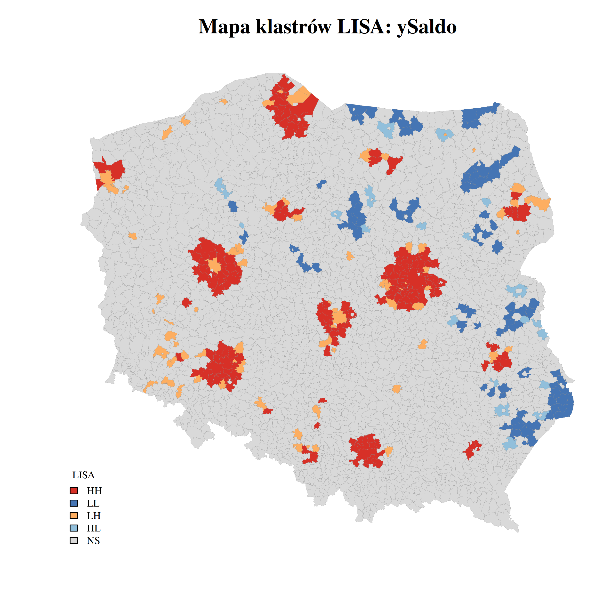
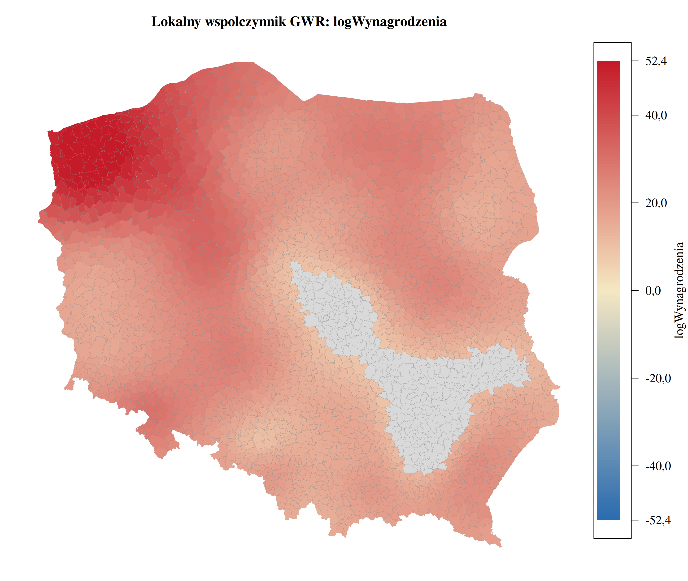
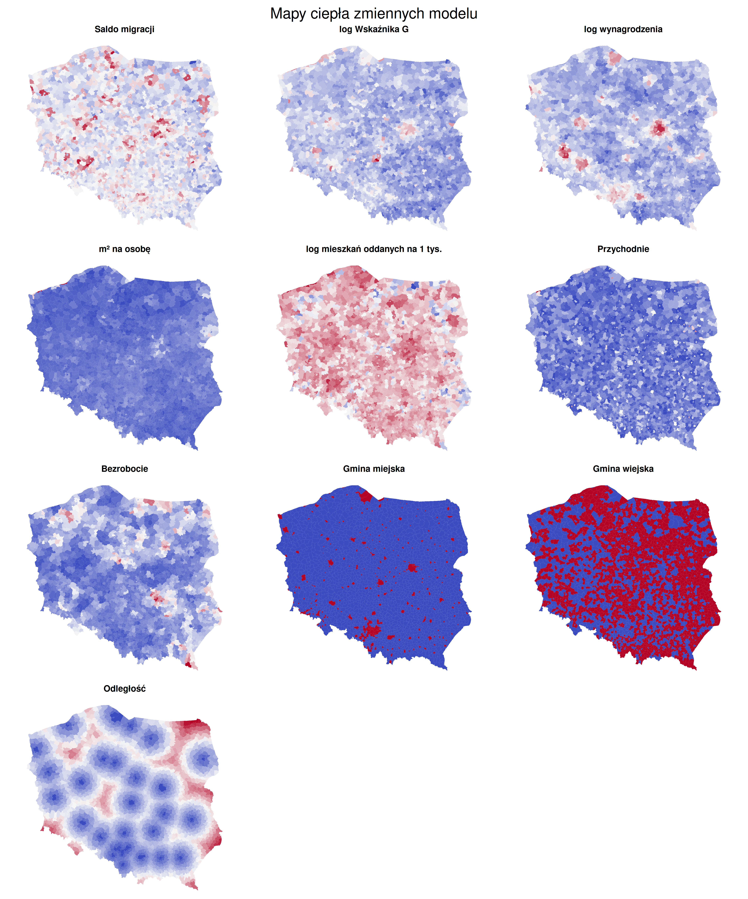

# Analiza przestrzenna migracji wewnętrznych na poziomie gmin w Polsce

Kod i wybrane wykresy z mojej pracy licencjackiej (Informatyka i Ekonometria, WNE UW, 2026). Badam przestrzenne zależności między saldem migracji wewnętrznych a cechami ekonomiczno-geograficznymi gmin, na danych za 2024 rok (n = 2477 gmin).

**Metody:** MNK/WMNK z imputacją MICE (reguły Rubina) · test Chowa · I Morana, C Geary’ego, LISA · modele przestrzenne SAR / SEM / SLX / SDM / SDEM / SAC / GNS · testy LM · regresja geograficznie ważona (GWR, mixed GWR, test F(3))

**Narzędzia:** R (`spdep`, `spatialreg`, `GWmodel`, `mice`, `sf`) · Python (`pandas`, `geopandas`, `statsmodels`, `scipy`)

## Główne wnioski

- Specyfikacja modelu WMNK wyjaśnia **43,4%** zmienności wskaźnika salda migracji. Czynnikiem najsilniej przyciągającym okazało się **wynagrodzenie**, najmocniej wypychającymi **bezrobocie** oraz miejski charakter gminy.
- Związek odległości od dużego miasta z saldem migracji jest w większości **ujemny i nieliniowy**: siła przyciągania największych miast do gmin sąsiednich słabnie wraz z odległością (efekt krańcowy ujemny na przedziale 0–107 km dla 98% obserwacji).
- Reszty MNK wykazują dodatnią, istotną **autokorelację przestrzenną**. Pominięcie aspektu przestrzennego nie daje pełnego obrazu, bo sąsiadujące gminy wchodzą ze sobą w interakcję i tworzą lokalne skupienia.
- Pierścienie podmiejskie największych miast tworzą klastry **High-High**, często z wyłączeniem rdzenia aglomeracji (Low-High). Gminy peryferyjne na wschodzie kraju formują klastry **Low-Low**.
- Wybrany model **SDEM** usuwa autokorelację reszt (I = −0,004; p = 0,617) i potwierdza istotne **efekty spillover**. Interakcje między gminami mają zazwyczaj charakter konkurencyjny: czynniki przyciągające w sąsiedztwie są ujemnie powiązane z saldem danej gminy.
- **GWR** ma lepsze dopasowanie niż benchmark MNK, a wszystkie parametry wykazują istotną heterogeniczność przestrzenną (test F(3)). Najwyższe lokalne R² model osiąga dla aglomeracji Warszawy, Poznania, Wrocławia, Łodzi i Krakowa.

## Wykresy

| | |
|---|---|
|  |  |
| Lokalne R² modelu GWR | Lokalny współczynnik GWR dla log wynagrodzeń |
|  |  |
| Wykres rozrzutu I Morana dla salda migracji | Mapy zmiennych modelu |

## Kod

| Plik | Co robi |
|---|---|
| [`R/01_mnk_wmnk_mice.R`](R/01_mnk_wmnk_mice.R) | statystyki opisowe, MNK/WMNK, diagnostyka, test Chowa, imputacja MICE i łączenie wyników regułami Rubina |
| [`R/02_modele_przestrzenne.R`](R/02_modele_przestrzenne.R) | macierz wag, I Morana / C Geary’ego / join-count / LISA, testy LM, estymacja i wybór modelu przestrzennego, efekty bezpośrednie i pośrednie |
| [`R/03_gwr.R`](R/03_gwr.R) | wybór pasma, GWR, test F(3), lokalna współliniowość, mapy współczynników |
| [`R/04_gwr_mieszany.R`](R/04_gwr_mieszany.R) | mixed GWR (parametry globalne i lokalne) |
| [`python/mnk_testy_zmiennych.py`](python/mnk_testy_zmiennych.py) | przygotowanie zmiennych, transformacje, eliminacja zmiennych i testy MNK |
| [`python/odleglosci_km.py`](python/odleglosci_km.py) | centroidy gmin (EPSG:2180) i odległość od najbliższego dużego miasta |

## Dane

Danych nie ma w repozytorium. Wszystkie pochodzą z publicznych źródeł:

- Bank Danych Lokalnych GUS (2024): saldo migracji na 1000 osób, bezrobocie, mediany wynagrodzeń, populacja, przystanki, przychodnie, mieszkania oddane do użytkowania, powierzchnia mieszkań per capita
- Ministerstwo Finansów: wskaźnik dochodów podatkowych gmin G (2024)
- Państwowy Rejestr Granic (GUGiK): granice gmin

Skrypty oczekują plików w katalogu `data/` w głównym folderze repozytorium.

## Licencja

Kod: [MIT](LICENSE). Wykresy: CC BY 4.0.
