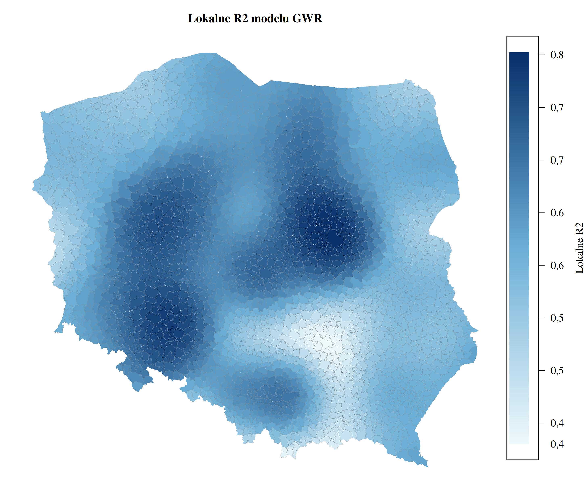
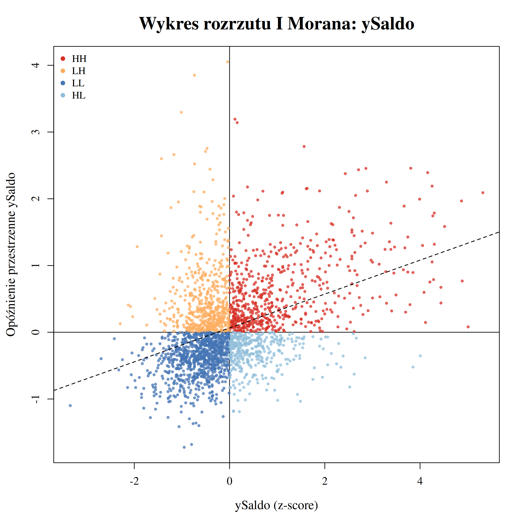

# Ekonometria przestrzenna: migracje wewnętrzne w gminach Polski


Dlaczego jedne gminy zyskują mieszkańców, a inne ich tracą?

Moja praca licencjacka (Informatyka i Ekonometria, WNE UW, 2026) sprawdza, jak saldo migracji wewnętrznych zależy od cech ekonomicznych i położenia gminy oraz od sytuacji w gminach sąsiednich. Mapa obok pokazuje skupiska gmin o wysokim (czerwone) i niskim (niebieskie) saldzie migracji.

**Dane:** 2477 gmin w 2024 roku, w tym saldo migracji, wynagrodzenia, bezrobocie, mieszkania, przychodnie, dochody podatkowe i odległość od dużego miasta

**Modele:** MNK i WMNK z imputacją MICE, modele przestrzenne SAR, SEM, SLX, SDM, SDEM, SAC i GNS, regresja geograficznie ważona GWR

**Testy:** Chowa, RESET, I Morana, C Geary’ego, join-count, LISA, testy LM, F(3) dla GWR

&nbsp; `spdep` `spatialreg` `GWmodel` `mice` `sf`<br>
&nbsp; `pandas` `geopandas` `statsmodels` `scipy`

<br clear="right">

## Najważniejsze wyniki

- Model WMNK wyjaśnia **43,4%** zmienności salda migracji. Najsilniej przyciąga **wynagrodzenie**. Najsilniej wypychają **bezrobocie** i miejski charakter gminy.
- Saldo migracji maleje nieliniowo wraz z odległością od dużego miasta. Efekt krańcowy jest ujemny w przedziale 0–107 km dla 98% gmin.
- Reszty MNK mają dodatnią, istotną autokorelację przestrzenną. Model bez części przestrzennej pomija interakcje między sąsiednimi gminami.
- Pierścienie podmiejskie największych miast tworzą klastry **High-High**, zwykle bez samego rdzenia aglomeracji (Low-High). Gminy peryferyjne na wschodzie tworzą klastry **Low-Low**.
- Model **SDEM** usuwa autokorelację reszt (I = −0,004; p = 0,617) i wykazuje istotne **efekty spillover**. Czynniki przyciągające w gminach sąsiednich są ujemnie powiązane z saldem danej gminy: gminy konkurują o migrantów.
- **GWR** dopasowuje się lepiej niż MNK. Wszystkie parametry zmieniają się istotnie w przestrzeni (test F(3)). Najwyższe lokalne R² model osiąga dla aglomeracji Warszawy, Poznania, Wrocławia, Łodzi i Krakowa.

## Ocena modelu

- **Forma funkcyjna.** Test RESET odrzuca poprawność specyfikacji MNK, także po dodaniu potęg i interakcji (31 istotnych zmiennych). Pozostałam przy prostszej, interpretowalnej specyfikacji, więc współczynniki MNK trzeba czytać ostrożnie.
- **Heteroskedastyczność.** WMNK ją ogranicza, ale w SDEM pozostaje (Breusch-Pagan p < 0,001). Błędy standardowe SDEM mogą być niewiarygodne.
- **Wybór modelu.** Kryteria AIC i log-likelihood wskazują GNS, ale najbardziej rozbudowany model jest podatny na overfitting. SDEM wybrałam na podstawie odpornych testów LM, a obie jego składowe przestrzenne są istotne.
- **Stabilność parametrów.** Test Chowa (F = 12,01; p < 0,001) pokazuje, że czynniki działają inaczej w gminach miejskich, wiejskich i miejsko-wiejskich. Jeden model dla wszystkich gmin to uproszczenie.
- **Overfitting GWR.** Optymalne pasmo to 61 gmin, czyli 2–3% próby. Lokalne współczynniki mogą częściowo odzwierciedlać szum. BIC wskazuje na MNK, a nie na GWR.
- **Braki danych.** 64 brakujące wartości uzupełniłam imputacją MICE. Ceny transakcyjne z Rejestru Cen Nieruchomości odrzuciłam, bo brakowało ok. 600 obserwacji.
- **Przyczynowość.** Dane przekrojowe za jeden rok pokazują zależności, nie przyczyny. Możliwa jest zależność zwrotna, np. napływ ludności podnosi podaż mieszkań. Ujemny znak dla przychodni sugeruje, że zmienna przybliża inny, nieuwzględniony czynnik.

## Wykresy

Pojęcia użyte w opisach wyjaśnia [DEFINICJE.md](DEFINICJE.md).

| Lokalne R² modelu GWR | Wpływ wynagrodzeń według GWR |
|---|---|
|  |  |
| Jak dobrze model wyjaśnia migracje w każdej gminie. Im ciemniej, tym lepiej. Najlepiej wokół Warszawy, Poznania i Wrocławia. | Siła związku wynagrodzeń z saldem migracji w każdej gminie. Najsilniejszy na Pomorzu Zachodnim. Na szaro gminy, w których związek jest nieistotny. |

| Zmienne modelu na mapie |
|:-:|
|  |
| Rozkład wszystkich zmiennych modelu. Czerwony oznacza wartości wysokie, niebieski niskie. Saldo migracji jest najwyższe wokół największych miast. |

| Wykres rozrzutu Morana |
|:-:|
|  |
| Każdy punkt to gmina: jej saldo migracji (oś X) i średnie saldo sąsiadów (oś Y).<br>Dodatnie nachylenie oznacza, że gminy o podobnym saldzie leżą obok siebie. |

## Kod

| | Plik | Zawartość |
|:-:|---|---|
|  | [`01_mnk_wmnk_mice.R`](R/01_mnk_wmnk_mice.R) | statystyki opisowe, MNK i WMNK, diagnostyka, test Chowa, imputacja MICE, reguły Rubina |
|  | [`02_modele_przestrzenne.R`](R/02_modele_przestrzenne.R) | macierz wag, statystyki autokorelacji, testy LM, wybór modelu przestrzennego, efekty bezpośrednie i pośrednie |
|  | [`03_gwr.R`](R/03_gwr.R) | wybór pasma, GWR, test F(3), lokalna współliniowość, mapy współczynników |
|  | [`04_gwr_mieszany.R`](R/04_gwr_mieszany.R) | mixed GWR z parametrami globalnymi i lokalnymi |
|  | [`mnk_testy_zmiennych.py`](python/mnk_testy_zmiennych.py) | przygotowanie i transformacje zmiennych, eliminacja zmiennych, testy MNK |
|  | [`odleglosci_km.py`](python/odleglosci_km.py) | centroidy gmin i odległość od najbliższego dużego miasta |

### Uruchomienie

```bash
uv sync                                  # pakiety Pythona z pyproject.toml
Rscript -e 'remotes::install_deps()'     # pakiety R z pliku DESCRIPTION
Rscript R/01_mnk_wmnk_mice.R             # kolejno 01, 02, 03, 04
```

## Dane

Dane nie są częścią repozytorium. Skrypty odczytują pliki z katalogu `data/`.

- [Bank Danych Lokalnych GUS](https://bdl.stat.gov.pl/bdl/start), 2024: saldo migracji na 1000 osób, bezrobocie, mediany wynagrodzeń, populacja, przystanki, przychodnie, mieszkania oddane, powierzchnia mieszkań na osobę
- [Ministerstwo Finansów](https://www.gov.pl/web/finanse/wskazniki-dochodow-podatkowych-gmin-powiatow-i-wojewodztw-na-2024-r), 2024: wskaźnik dochodów podatkowych gmin G
- [Państwowy Rejestr Granic, GUGiK](https://dane.gov.pl/pl/dataset/726,panstwowy-rejestr-granic-i-powierzchni-jednostek-podziaow-terytorialnych-kraju): granice gmin

## Definicje

Wszystkie pojęcia i metody z pracy, od salda migracji po test F(3), są wyjaśnione w [DEFINICJE.md](DEFINICJE.md).

## Licencja

Kod: [MIT](LICENSE). Wykresy: CC BY 4.0.
